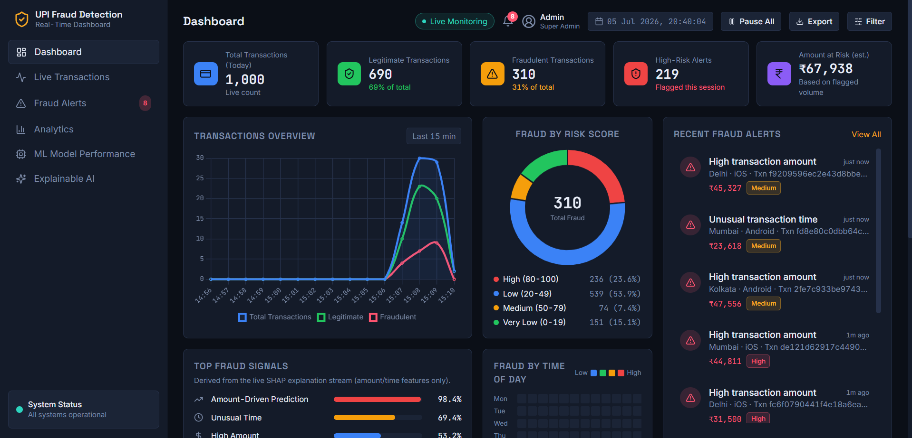
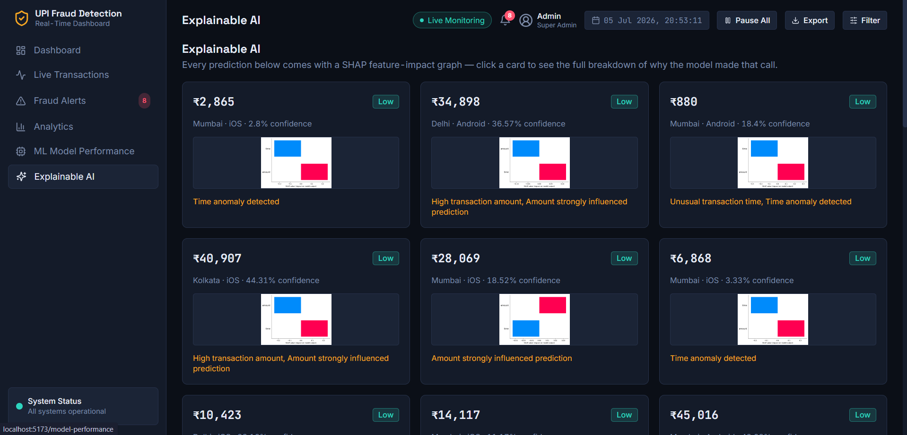
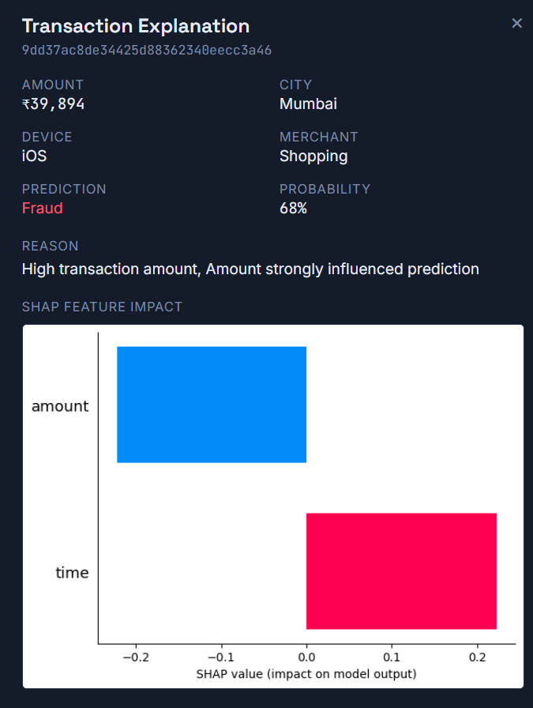
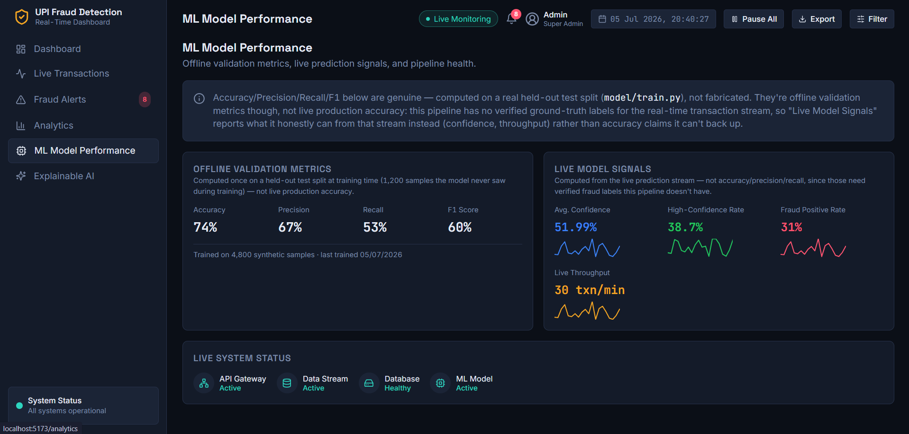

# UPI Fraud Detection — Real-Time Dashboard

A real-time transaction monitoring pipeline that simulates UPI (Unified Payments Interface) transactions, scores each one for fraud using a machine learning model, explains *why* using SHAP, and streams the results into a live React dashboard.







## What it does

Every 2 seconds, a synthetic UPI transaction (amount, time, city, device, merchant category) is generated and pushed through a message queue to a scoring service. The scoring service runs it through a Random Forest model, generates a SHAP explanation for the prediction, and stores the result. A React dashboard polls the results and displays live KPIs, charts, a risk-scored transaction feed, and per-transaction explainability.

## Architecture

```
Generator  --->  RabbitMQ  --->  Consumer  --->  MongoDB Atlas  --->  Flask API  --->  React Dashboard
(simulates      (message         (ML model +      (stores scored                      (polls every
 transactions)   queue)          SHAP explainer)   transactions)                        2.5s)
```

| Component | Tech | Role |
|---|---|---|
| Generator | Python, Pika | Publishes simulated transactions to a RabbitMQ queue every 2s |
| Message Queue | RabbitMQ (CloudAMQP in production) | Decouples generation from scoring |
| Consumer | Python, scikit-learn, SHAP | Scores each transaction, generates a SHAP explanation, writes to MongoDB |
| Database | MongoDB Atlas | Stores every scored transaction |
| API | Flask, flask-cors | Aggregates data (KPIs, breakdowns, alerts, heatmaps) and serves JSON |
| Dashboard | React, Vite, Tailwind, Chart.js, react-router-dom | Live-polling dashboard with 6 pages |

## Features

- **Live KPIs** — total/legitimate/fraudulent transaction counts, fraud rate, amount at risk
- **Transactions Overview** — real-time volume chart (total/legitimate/fraudulent, last 15 minutes)
- **Fraud by Risk Score** — donut chart with 4-tier risk breakdown (probability-based)
- **Recent Fraud Alerts** — live feed of flagged transactions
- **Explainable AI** — every prediction includes a SHAP feature-impact graph, showing exactly how much each feature (amount, time) pushed the model toward or away from flagging it as fraud
- **Fraud signal breakdown** — derived from the real reasons the model flags things (not fabricated categories)
- **Fraud by Time of Day** — heatmap of when fraud actually occurs, from real transaction timestamps
- **6-page dashboard** — Dashboard, Live Transactions, Fraud Alerts, Analytics, ML Model Performance, Explainable AI, all sharing one live data feed

## Honest limitations (by design, not oversight)

This is a learning/demo project, and the README says so rather than dressing it up:

- **The model only uses two features: `amount` and `time`.** It cannot detect device anomalies, location velocity, or multi-transaction patterns — those would need session/history features this pipeline doesn't collect.
- **Synthetic data.** Transactions are randomly generated, not real UPI data — this is a pipeline/architecture demo, not a production fraud system.
- **"ML Model Performance" shows two different kinds of metrics, and is explicit about which is which:**
  - *Offline validation metrics* (Accuracy/Precision/Recall/F1) — genuinely computed on a held-out test split (`model/train.py`), from a synthetic-but-probabilistic dataset (fraud isn't perfectly separable by amount/time alone, so these numbers are realistic — not a suspicious 100%).
  - *Live model signals* (confidence, throughput) — computed from the actual real-time prediction stream. These are shown separately from the offline metrics above because the pipeline has no verified ground-truth labels for real-time transactions, so live "accuracy" isn't something it can honestly claim.

## Running it locally

**Prerequisites:** Python 3.10+, Node.js, a local RabbitMQ install, a MongoDB Atlas cluster (free tier works).

```bash
# Backend
cd upi-fraud-detection
python -m venv venv
venv\Scripts\activate          # Windows
pip install -r requirements.txt

# Create a .env file in the project root:
# MONGO_URI=mongodb+srv://<user>:<password>@<cluster>.mongodb.net/?appName=<app>
```

Open 3 terminals (venv activated in each):
```bash
python -m generator.generate   # publishes simulated transactions
python -m consumer.consumer    # scores + explains + stores them
python -m consumer.app         # serves the API on :5000
```

Frontend:
```bash
cd dashboard-frontend
npm install
# Create dashboard-frontend/.env:
# VITE_API_URL=http://localhost:5000
npm run dev
```

Open `http://localhost:5173`.

## Deployment

`render.yaml` deploys the full stack on Render:
- API + generator + consumer as free-tier **Web Services** (background workers are wrapped in a minimal Flask health endpoint so they qualify for Render's free tier — the real work runs in a background thread)
- Dashboard as a free **Static Site**
- RabbitMQ via CloudAMQP (free tier), MongoDB via Atlas (free tier)

Free-tier web services spin down after ~15 minutes idle — expect a cold-start delay after inactivity, or set up an external uptime pinger (e.g. cron-job.org) if you want it to stay warm.

## Tech Stack

**Backend:** Python, Flask, Pika (RabbitMQ), PyMongo, scikit-learn, SHAP, Gunicorn
**Frontend:** React, Vite, Tailwind CSS, Chart.js, react-router-dom, Lucide icons
**Infrastructure:** RabbitMQ / CloudAMQP, MongoDB Atlas, Render
